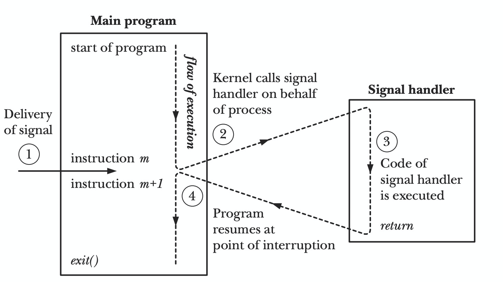

# 1.14 scheduler

## 流程概述

抢占流程主要有两个入口，GC 和 sysmon。

TODO，control flow pic show

## 信号处理

信号处理涉及两个 syscall:

* tigkill

* sigaction

### 简单的信号处理函数

简单起见，这里我们使用 C 来做演示:

## gsignal

gsignal 是一个特殊的 goroutine，类似 g0，每一个线程都有一个，创建的 m 的时候，就会创建好这个 gsignal，在 linux 中为 gsignal 分配 32KB 的内存:

newm -> allocm -> mcommoninit -> mpreinit -> malg(32 * 1024)

在线程处理信号时，会短暂地将栈从用户栈切换到 gsignal 的栈，执行 sighandler，执行完成之后，会重新切换回用户的栈继续执行用户逻辑。

## 现场保存和恢复

### GC 抢占流程

suspendG

resumeG

### sysmon 抢占流程

preemptone -> asyncPreempt -> globalrunqput

## 参考资料

1. The Linux Programming Interface
